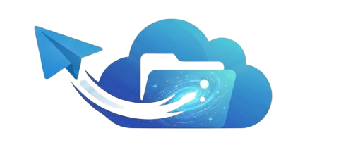

<div align="center">
  <a href="https://github.com/H24ai/TeleSpace">
    
  </a>
  <h1 align="center">TeleSpace</h1>

  <p align="center">
    <strong>A Next-Generation Cloud Storage System Powered by Telegram Infrastructure</strong>
    <br />
    <br />
    <a href="#features">Features</a>
    ·
    <a href="#architecture">Architecture</a>
    ·
    <a href="#getting-started">Getting Started</a>
    ·
    <a href="#api-documentation">API Docs</a>
  </p>
  <p align="center">
    
    
    
    
    
  </p>
</div>

<hr />

## 📖 About The Project

**TeleSpace** is a highly scalable, self-hosted cloud storage solution that leverages Telegram's limitless cloud infrastructure. By utilizing a local Telegram Bot API server, TeleSpace bypasses standard file-size limitations, offering a seamless and unified file management experience. 

It features a dual-interface architecture: a native **Telegram Bot** for immediate, frictionless access, and a robust **FastAPI backend** tailored for mobile app integration and external system connectivity.

### ✨ Key Features

* 🚀 **Limitless Storage Engine:** Bypasses standard Telegram upload/download limits via a locally hosted Telegram API server.
* 📂 **Hierarchical Organization:** Structure your data with Sections, Folders, and Sub-folders, backed by a relational PostgreSQL database.
* 🔌 **Dual Interface:** Manage files via the interactive Telegram Bot or programmatically via the RESTful FastAPI (with proxy streaming support).
* 🤖 **AI-Powered Guide:** Built-in intelligent assistant integrated with advanced AI models to help users navigate and manage their space.
* 🔐 **Granular Access Control:** Generate secure, shareable links with specific permission levels (Viewer/Admin).
* ⚙️ **Smart Automation:** Automatically watch and sync content from linked Telegram channels, groups, and forum topics.

---

## 🏗️ System Architecture

TeleSpace is fully dockerized and operates on a 4-tier microservice architecture:

| Service | Description | Technology |
| :--- | :--- | :--- |
| **Database** | Centralized metadata storage for users, file locations, permissions, and session tracking. | `PostgreSQL 15` |
| **Local API Server** | Handles raw file streaming and large document processing directly with Telegram servers. | `aiogram/telegram-bot-api` |
| **Telegram Bot** | The interactive user interface, utilizing advanced conversation handlers. | `python-telegram-bot` |
| **REST API** | The gateway for mobile applications, featuring Bearer Token authentication. | `FastAPI` & `Uvicorn` |

---

## 🚀 Getting Started

Follow these instructions to get a local copy up and running in a Dockerized environment.

### Prerequisites

* [Docker](https://docs.docker.com/get-docker/) and Docker Compose
* A Telegram Bot Token from [@BotFather](https://t.me/botfather)
* Telegram API ID and Hash from [my.telegram.org](https://my.telegram.org)

### Installation

1. **Clone the repository**
   ```bash
   git clone https://github.com/yourusername/TeleSpace.git
   cd TeleSpace
   ```

2. **Configure Environment Variables**
   Copy the example environment file and fill in your secure credentials:
   ```bash
   cp .env.example .env
   ```
   *Make sure to provide your `TELEGRAM_BOT_TOKEN`, `DATABASE_URL`, and `TELEGRAM_API_ID/HASH`.*

3. **Launch the Infrastructure**
   Build and start the containers using Docker Compose:
   ```bash
   docker-compose up -d --build
   ```

4. **Initialize Database Schema**
   The application will automatically connect and create the necessary tables on the first run.

---

## 📡 API Documentation

TeleSpace features an auto-generated, interactive Swagger UI for the REST API. Once the Docker containers are running, navigate to:

👉 **http://localhost:8000/docs**

### Standard Headers
All protected API endpoints require Bearer Token authorization:
```http
Authorization: Bearer <YOUR_ACCESS_TOKEN>
```

---

## 📂 Project Structure

```plaintext
TeleSpace/
├── api/                  # FastAPI endpoints (Auth, Explorer, Items, Share)
├── app/                  # Main Application logic
│   ├── bot/              # Telegram Bot Handlers and UI Navigation
│   └── shared/           # Core database models, AI integration, and configs
├── static/               # Local storage for thumbnails and cached media
├── docker-compose.yml    # Service orchestration
└── requirements.txt      # Python dependencies
```
*(For a detailed breakdown, please see PROJECT_STRUCTURE.md)*

---

## 🤝 Contributing

Contributions are what make the open-source community such an amazing place to learn, inspire, and create. Any contributions you make are **greatly appreciated**.

1. Fork the Project
2. Create your Feature Branch (`git checkout -b feature/AmazingFeature`)
3. Commit your Changes (`git commit -m 'Add some AmazingFeature'`)
4. Push to the Branch (`git push origin feature/AmazingFeature`)
5. Open a Pull Request

---

## 📜 License

Distributed under the MIT License. See `LICENSE` for more information.

---

<div align="center">
  <p>Development by <b>Hassan AL-Naqeeb</b></p>
</div>
